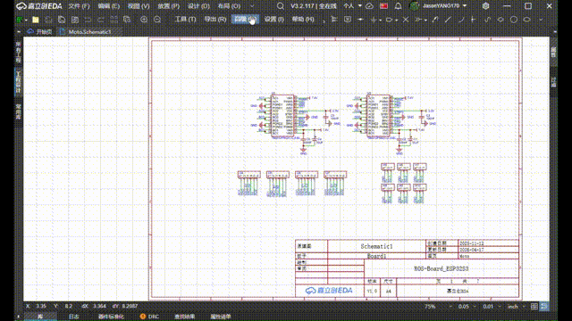
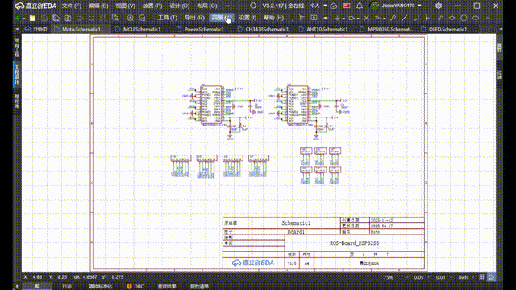
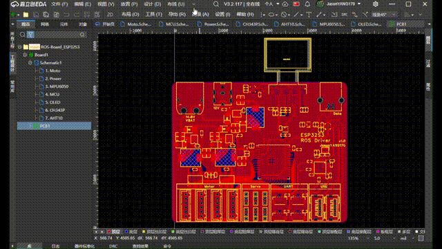
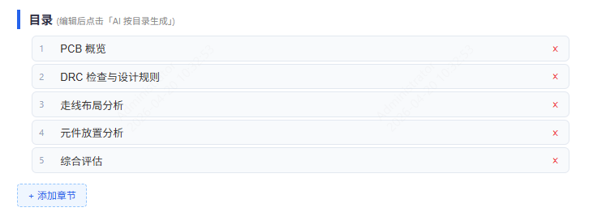
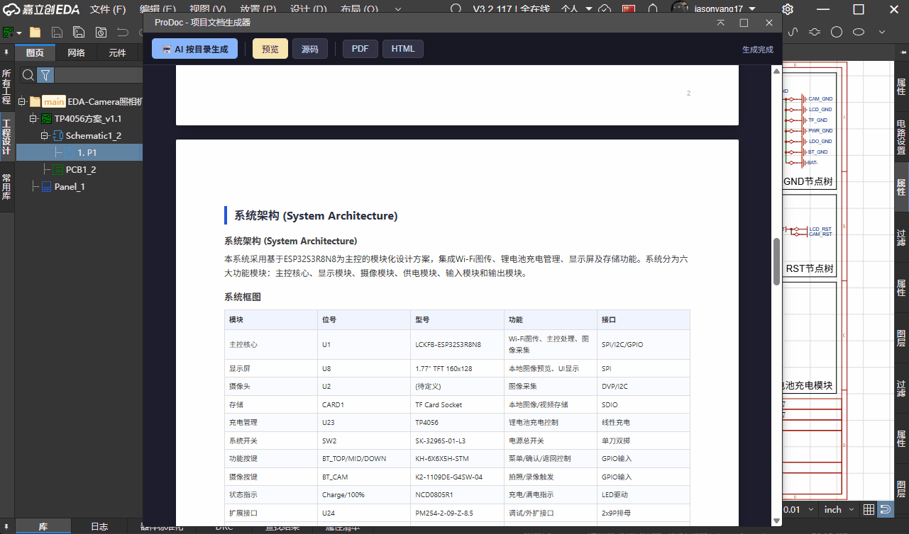
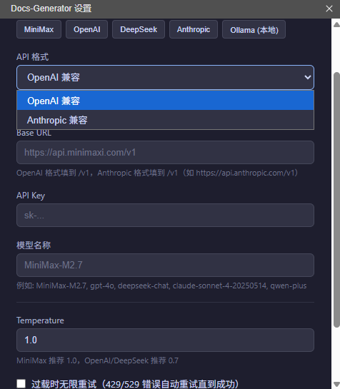
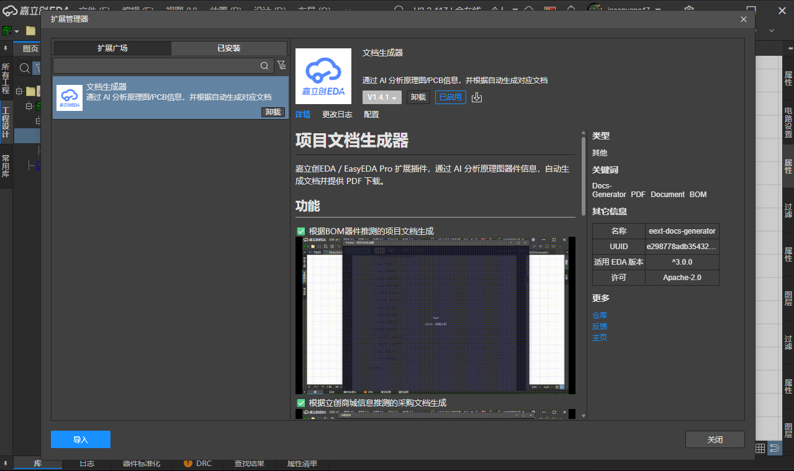
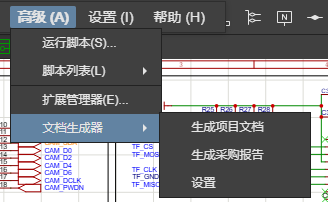

# AI Document Generator

An extension for JLCEDA / EasyEDA Pro that uses AI to analyze component information, automatically generate documents, and provide PDF downloads.

## Features

✅ Project document generation based on BOM component inference  

✅ Procurement document generation based on LCSC (JLCPCB Parts) information  

✅ Design report document generation based on PCB inference  

✅ Document generation with customizable table of contents  

✅ Real-time editing and HTML source editing for generated documents  

✅ Compatible with mainstream API formats, with adjustable Temperature settings  

## Installation
## Usage
1. Import the `eext-docs-generator.eext` extension file via "Advanced" > "Extension Manager".  

2. Open a schematic or PCB view, then click "Advanced" > "Document Generator" in the top navigation bar and select the desired function.  

